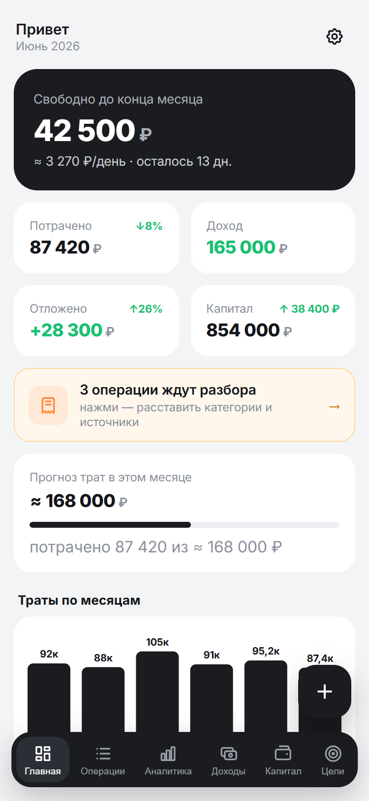
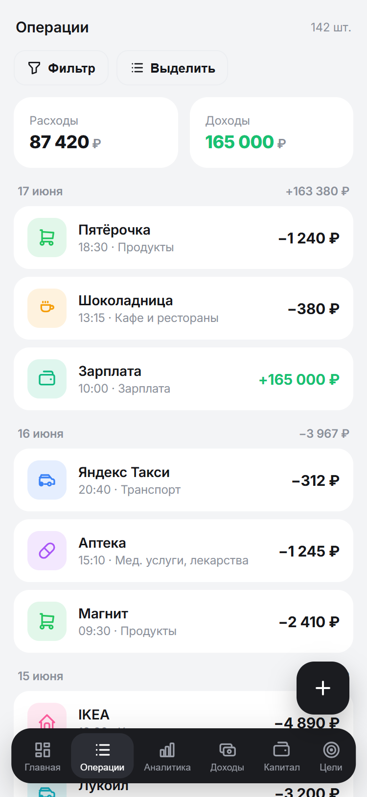
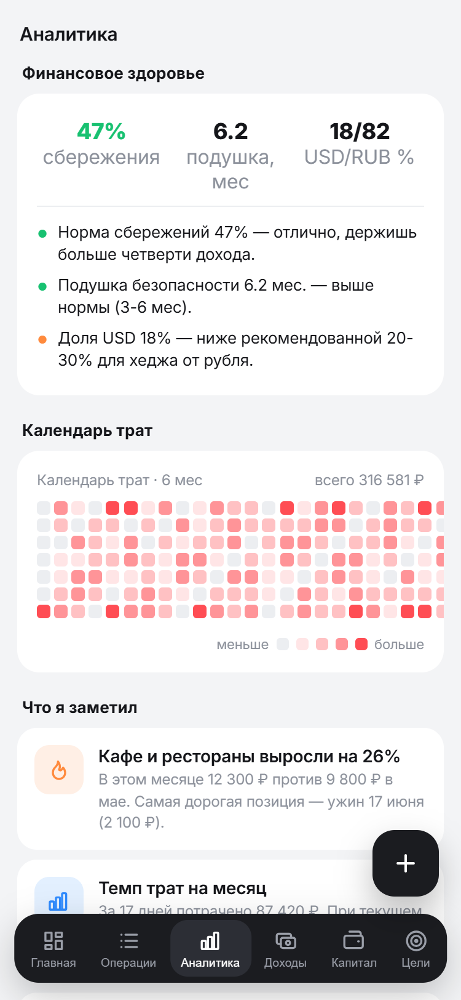
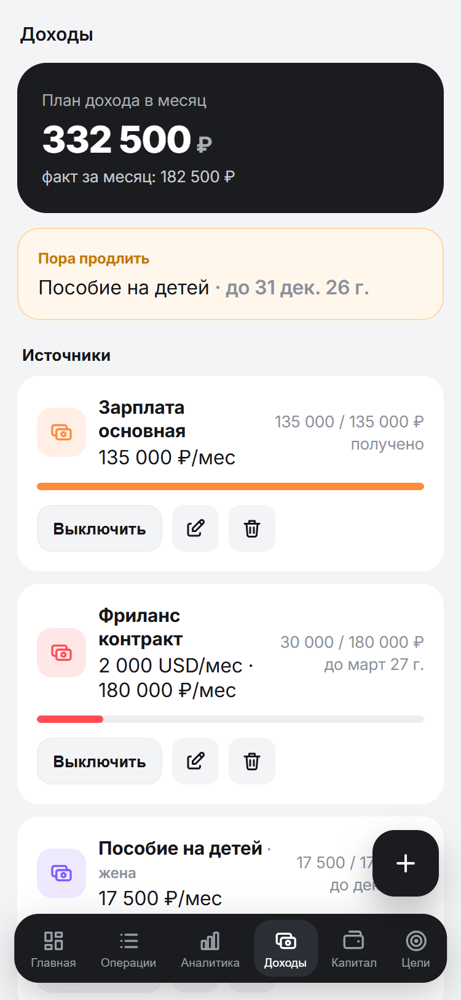
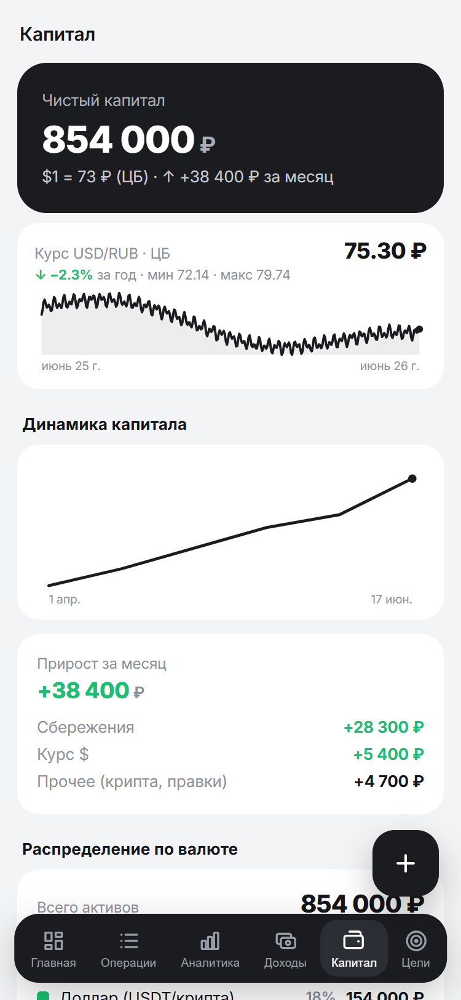
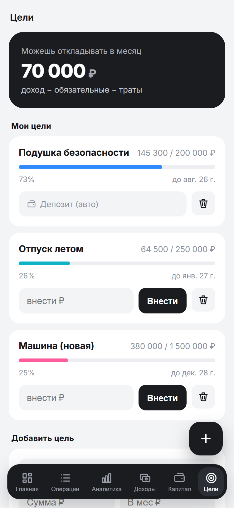

# MONEY — личный финансовый помощник

Telegram-бот + веб мини-апп для учёта личных финансов одного пользователя.
Принимает чеки (фото с QR → ФНС), текст, голос и банковские выписки, сам всё
категоризирует нейросетью и показывает дашборд: траты, капитал, цели, прогнозы.

- Бот: **@money_veta_bot** · Мини-апп: **https://money.vetaone.site**
- Боевой сервер: `166.88.159.91` (контейнер `money_app` за общим Caddy)

> README — актуальное состояние сервиса. [SPEC.md](SPEC.md) — исходная спецификация/видение.

---

## Скриншоты

<sub>На демо-данных. Реальные цифры/имена в репозиторий не попадают — БД с операциями, токены и фото чеков защищены `.gitignore`.</sub>

<table>
  <tr>
    <td width="33%" valign="top"><br/><sub align="center"><b>Главная</b> · safe-to-spend, цифры месяца с Δ, прогноз, график</sub></td>
    <td width="33%" valign="top"><br/><sub align="center"><b>Операции</b> · фильтры, группировка по дням, итог по выборке</sub></td>
    <td width="33%" valign="top"><br/><sub align="center"><b>Аналитика</b> · чекап + «Что я заметил»</sub></td>
  </tr>
  <tr>
    <td width="33%" valign="top"><br/><sub align="center"><b>Доходы</b> · источники, план-факт, продление</sub></td>
    <td width="33%" valign="top"><br/><sub align="center"><b>Капитал</b> · net worth, курс USD/RUB за год, разбивка</sub></td>
    <td width="33%" valign="top"><br/><sub align="center"><b>Цели</b> · прогресс, прогноз, регулярные платежи</sub></td>
  </tr>
</table>

---

## Возможности

**Ввод (бот):**
- 🧾 Фото чека с QR → распознаём QR → API ФНС `/scan` → состав по товарам.
- 📷 Фото без QR (ценник/квитанция) → vision-нейросеть определяет трату.
- ✍️ Текст: «такси 300», «зарплата 135000», «дал другу 5000 в долг».
- 🎙️ Голос → расшифровка (Gemini) → как текст.
- 📄 CSV-выписка Райффайзена (файлом) → импорт со склейкой и категоризацией.

**Обработка:**
- Категоризация по позициям: правила (`CategoryRule`) → LLM (Gemini) → порог уверенности; **учится** на правках.
- **Двусторонняя склейка чек↔выписка**: чек находит операцию выписки по сумме ±72ч и обогащает её составом (и наоборот при импорте выписки); дубли исключены (по `fn+fd+fp` и по сумме±время). Под распознанной операцией в боте — кнопка «📂 Открыть в приложении» (deep-link к этой операции).
- Возвраты (чек `operationType=2`) → минус-расход. Долги (занял/дал) → влияют на капитал, не на траты.

**Мини-апп (6 вкладок):**
- **Главная** — safe-to-spend; четыре цифры месяца (потрачено/доход/отложено/капитал) со стрелками Δ к прошлому месяцу в одной строке с заголовком (компактно); «N трат ждут разбора»; прогноз месяца; график трат по месяцам; категории с Δ и **мини-спарклайнами трендов за 6 мес** (клик → операции категории); последние операции + «Все операции»; **шестерёнка → Настройки**.
- **Операции** — полный список с фильтрами (период/тип/категория/поиск по продавцу/сумма от-до/«на разбор»), группировкой по дням с дневным итогом, итогом по выборке, пагинацией; **клик по продавцу** → его операции; **bulk edit** (выделить N → массовая правка категории); тап → правка категорий + заметка; ручное добавление операции (включая **перевод между счетами**); метка возвратов.
- **Аналитика** — **финансовое здоровье** (норма сбережений, подушка, USD/RUB, персональные рекомендации) + **календарь трат за 6 мес** (heatmap по дням — мгновенно видны паттерны «тяжёлых» дней) + **«Что я заметил»** (аномалии трат, spending velocity, топ-3 крупных, аудит подписок, pace к цели, ближайшие списания); **бюджет месяца** (лимит по категории: свой или авто-прогноз; план-факт с прогресс-барами; свод доход−расходы−цели = профицит); переключатель периода (месяц/квартал/год); доход/расход/накоплено + норма сбережений; доходы-vs-расходы по месяцам; сравнение с прошлым периодом по категориям (Δ%); структура расходов (сегментированная полоса + 2-колоночные карточки с мини-иконкой); топ-продавцы; подписки.
- **Доходы** — источники дохода (зарплата, фриланс, пособия) с иконкой, **правкой имени/суммы/валюты/периода/владельца/срока**, планом-фактом за месяц, разбивкой «откуда пришло» (сегментированная полоса), владельцем (я/жена) и нуджами «пора продлить»; план дохода = сумма активных источников. У операции дохода — своя категория (Зарплата/Премия/Кешбэк…) и привязка к источнику вручную (с обучением — впредь привязывается автоматически).
- **Капитал** — net worth (мультивалюта по курсу ЦБ) с Δ; **компактный график курса USD/RUB за год** (текущий курс ЦБ, Δ% за год, мин/макс); линия динамики капитала; разбивка прироста (сбережения / курс $ / прочее); **распределение по валюте** (RUB/USD); **подушка безопасности** (мес расходов); **цель капитала** + прогноз достижения + «отложено в этом месяце»; счета с **бренд-цветами банков** (Тинькофф/Сбер/Райф/Альфа/ВТБ/Газпром/Озон/Яндекс/Почта/МТС — узнавание с первого взгляда), CRUD, баланс инлайн; **долги** (несколько контрагентов, частичные погашения, прогресс «отдано/осталось», остаток в капитале); **вклады с доходностью** (ставка, прогноз, начисленные %).
- **Цели** — прогресс/прогноз достижения, **привязка цели к счёту** (сумма авто из баланса), создание целей, регулярные платежи (мес/год, правка **имени и суммы**) + авто-детект кандидатов.

**Настройки** (шестерёнка на Главной): тема (Авто/Светлая/Тёмная); порог «крупной траты» (`alert_big`); **управление категориями** (CRUD: имя, родитель, цвет из палитры 14, иконка из набора 32; пустые удаляются насовсем, с операциями — архивируются); справочно — расписание дайджестов и о приложении.

**UX-плюшки:** глобальный **FAB «+»** на всех вкладках — операция добавляется в два тапа; **skeleton-loaders** вместо «Загрузка…» — воспринимаемая скорость +30%; плавная анимация смены вкладок (fade); haptic-feedback в ключевых местах.

**Расчёты:** safe-to-spend = доход (сумма источников) − траты − обязательные − взносы в цели; net worth в рублях; прогноз по категориям (среднее за 3 мес); персональная норма сбережений.

**Уведомления (по расписанию, МSK):** алерты в момент траты (крупная ≥ лимита, перебор бюджета по категории) + нудж продлить регулярные (10:30); дайджест ежедневно 21:00 / еженедельно вс 20:00 / месячно 1-го 10:00. Команды `/report`, `/week`, `/month`. Бэкап БД 03:30, снимок капитала 03:00, автообновление токена ФНС 04:00.

---

## Архитектура

```
Telegram ──webhook──▶ FastAPI (один процесс) ──▶ SQLite (WAL)
   │                     ├─ aiogram (бот)
   │                     ├─ REST API (/api/*) для мини-аппа
   │                     ├─ APScheduler (дайджесты, бэкап, снимок капитала)
   │                     └─ services: qr, fns, llm, categorize, ingest, …
   ▼
Caddy (общий на сервере) ──TLS──▶ money.vetaone.site → money_app:8000
```

- **Один процесс** Python: FastAPI отдаёт API + статику мини-аппа и принимает Telegram-webhook (без polling). На слабом VPS экономно.
- **БД — SQLite (WAL)** через SQLAlchemy. Один пользователь → отдельный сервер БД не нужен, бэкап = один файл; при росте меняется на Postgres сменой `DATABASE_URL`.
- **Frontend** — один файл `frontend/index.html` (ванильный HTML/CSS/JS + Telegram WebApp SDK, иконки Tabler инлайн). Отдаётся самим FastAPI (StaticFiles). Без сборки — надёжно на слабом сервере.
- **Деплой** — Docker (контейнер `money_app`) в существующей сети Caddy `my_server_caddy_net`; **свой nginx/порты 80-443 не поднимаем** — маршрут даёт общий Caddy.

## Стек
Python 3.12 · FastAPI · aiogram 3 · SQLAlchemy 2 · APScheduler · httpx · opencv+pyzbar (QR) · cryptography (бэкап) · Docker · Caddy. Frontend — vanilla JS + Telegram WebApp SDK.

---

## Структура репозитория

```
backend/
  app/
    main.py            # FastAPI: API мини-аппа, webhook, lifespan, планировщик
    config.py          # настройки из .env (pydantic-settings)
    db.py              # SQLAlchemy engine + сессия (SQLite WAL)
    models.py          # схема БД (все таблицы)
    migrations.py      # лёгкие идемпотентные миграции (ADD COLUMN/индексы)
    security.py        # проверка Telegram initData + вайтлист владельца
    bot.py             # aiogram: приём фото/текст/голос/CSV, команды, инлайн-правка категории
    seed_categories.py # заливка categories.json
    seed_accounts.py   # заведение счетов
    services/
      qr.py            # распознавание QR (opencv + pyzbar)
      fns.py           # клиент API ФНС lkdr.nalog.ru (логин/refresh/scan)
      receipt.py       # парсинг ответа ФНС /scan → товары
      statement.py     # парсер CSV-выписки Райффайзена
      ingest.py        # оркестратор приёма (фото/текст/голос/выписка → транзакции)
      categorize.py    # категоризация: правила → Gemini → порог; обучение
      llm.py           # Gemini (ротация ключей на 429/5xx) + OpenRouter
      alerts.py        # алерты (крупная трата, перебор бюджета) + нуджи продления
      analytics.py     # аналитика: кэшфлоу, сравнение, топ-продавцы, подписки
      budget.py        # бюджет по категориям (план-факт, профицит)
      capital.py       # капитал: net worth, разбивка, распределение, подушка, цель
      checkup.py       # финансовый чекап (норма сбережений, подушка, рекомендации)
      dashboard.py     # сводка для дашборда
      deposits.py      # вклады: доходность, прогноз, начисленные %
      income.py        # доходы по источникам (план-факт, разбивка, нуджи)
      planning.py      # цели, прогноз, обязательные, авто-детект регулярных
      fx.py            # курс USD (ЦБ) → рубли, net worth, история курса (CBR XML_dynamic)
      trends.py        # траты по месяцам, снимки net worth
      digests.py       # тексты и отправка дайджестов
      backup.py        # зашифрованный бэкап БД в Telegram
      settings_store.py# key-value настройки в БД
  requirements.txt
  .env.example
  data/                # SQLite (money.db) + tokens.json ФНС — gitignored, бэкапим
frontend/index.html    # мини-апп (vanilla, Telegram WebApp)
deploy/                # Dockerfile, docker-compose.yml, caddy-money.conf
categories.json        # дерево категорий пользователя
.github/workflows/     # автодеплой (не активен — нужен scope workflow)
SPEC.md                # исходная спецификация
```

---

## Модель данных (SQLite)

`accounts` (счета: card/cash/deposit/crypto/external, валюта, владелец me/wife, баланс) ·
`categories` (expense/income/transfer, иерархия) ·
`transactions` (сумма+валюта+`base_amount_rub`, тип, категория, продавец, источник, `dedup_key`) ·
`transaction_items` (позиции чека, своя категория) ·
`receipts` (фискальные данные: fn/fd/fp, JSON ответа ФНС) ·
`category_rules` (выученные правила) · `recurring` (регулярные доходы/расходы = источники дохода, period, owner me/wife) ·
`goals` · `budgets` (лимиты по категориям) · `debts` · `deposits` · `net_worth_snapshots` · `fx_rates` · `external_reports` (для сверки жены) · `settings` (key-value).

---

## API (всё под `current_user`: заголовок `X-Telegram-Init-Data`, только владелец)

| Метод | Путь | Назначение |
|---|---|---|
| GET | `/api/health` | проверка (без авторизации) |
| GET | `/api/dashboard` | сводка главной |
| GET | `/api/trends` | траты по месяцам + снимки капитала |
| GET | `/api/analytics` | аналитика по периоду (`?period=month\|quarter\|year`): кэшфлоу, сравнение, структура расходов, топ-продавцы, подписки |
| GET/POST | `/api/budgets` | бюджет по категориям: план-факт + свод (профицит); задать/сбросить лимит |
| GET | `/api/transactions` | список операций: фильтры (месяц/диапазон, тип, категория, счёт, поиск, суммы), пагинация, итог по выборке |
| POST | `/api/tx` | ручное добавление операции (тип/сумма/валюта/категория/счёт/счёт-получатель/заметка/дата) |
| POST | `/api/tx/{id}/note` | заметка на операции |
| POST | `/api/transactions/bulk` | массовая правка категории у списка операций |
| GET/POST | `/api/accounts` · `/api/accounts/{id}` · `/{id}/edit` · DELETE | счета: список/создать/баланс/править/удалить |
| GET | `/api/capital` | капитал: линия net worth, Δ, разбивка прироста, распределение по валюте, подушка, цель + прогноз |
| POST | `/api/capital/target` | цель капитала (net worth target) |
| GET | `/api/fx/history?currency=USD&days=365` | история курса (ЦБ XML_dynamic, бэкфил при первом запросе) |
| GET | `/api/heatmap?days=180` | дневные суммы трат → грид «календарь трат» (heatmap) |
| GET/POST `/api/deposits` · POST `/api/deposits/{id}` · DELETE | вклады с доходностью (CRUD + расчёт доходности/прогноза) |
| GET | `/api/checkup` | финансовый чекап: норма сбережений, подушка, распределение, рекомендации |
| GET/POST | `/api/settings` | ожидаемый доход |
| GET/POST | `/api/categories` · POST `/api/categories/{id}` · DELETE | категории по типу (`?type=income\|expense`), частые сверху; CRUD: имя, родитель, иконка, цвет; удаление архивирует, если есть привязки |
| GET/POST | `/api/kv/{key}` | generic key-value настройки (`alert_big`, `networth_target` и др.) |
| GET `/api/tx/{id}` · POST `/api/tx/{id}` · POST `/api/tx/{id}/source` · POST `/api/items/{id}` | детали операции; смена категории операции/позиции; привязка дохода к источнику |
| GET/POST `/api/goals` · POST `/api/goals/{id}` · DELETE | цели |
| GET/POST `/api/recurring` · POST `/api/recurring/{id}` · DELETE · `/dismiss` | регулярные расходы: список/создать/править/удалить/скрыть |
| GET/POST `/api/income` · POST `/api/income/{id}` · DELETE | источники дохода: свод (план-факт, разбивка, нуджи) + CRUD |
| GET/POST `/api/debts` · POST `/api/debts/{id}/pay` · `/close` · DELETE | долги: список/создать/частичное погашение/закрыть/удалить |
| POST | `/webhook` | приём Telegram (проверка `WEBHOOK_SECRET`) |

Бот-команды: `/start`, `/report`, `/week`, `/month`, `/backup`.

---

## ФНС (lkdr.nalog.ru)

- Логин по SMS защищён Yandex SmartCaptcha и режется по не-RU IP (`blocked.ip`) → делается **вручную в браузере** на российском IP, токены импортируются в `data/tokens.json` (`token`, `refreshToken`, `sourceDeviceId`).
- `/scan` и refresh работают с любого IP (в т.ч. US-сервер). Refresh-токен долгоживущий → ручной логин редко.
- **Авто-обновление access-токена** по refresh при любой токен-ошибке (401/403, «срок действия истёк») + ежедневный прогрев (04:00). Если refresh умер — бот сам зовёт на повторный вход.
- ⚠️ Суммы в ответе `/scan` приходят **в рублях** (float), не в копейках.
- Если ФНС начнёт блокировать IP сервера — задать `FNS_PROXY` (RU-прокси), применится только к запросам ФНС.

## LLM

- **Gemini** (прямые ключи Google AI, `GEMINI_KEYS` через запятую) — голос, vision, парсинг текста, категоризация. Ротация ключей на 429/5xx. Модель `GEMINI_MODEL` (сейчас `gemini-2.5-flash`).
- **OpenRouter** (`OPENROUTER_PAID_KEY`, `PAID_MODEL`) — для тяжёлой аналитики.
- Все вызовы — на сервере; ключи наружу не уходят.

## Безопасность

- Аутентификация мини-аппа — Telegram `initData` (HMAC токеном бота, `app/security.py`), **вайтлист одного `OWNER_TG_ID`**; чужим — 401/403.
- Webhook — секрет `WEBHOOK_SECRET` (заголовок Telegram).
- Секреты в `.env` (gitignored). `tokens.json`, БД, фото чеков, референсы — не в гите.
- Бэкап БД — зашифрован (Fernet, ключ из `BACKUP_PASSPHRASE`), уходит в личку владельца.

---

## Конфигурация (`backend/.env`, см. `.env.example`)

`BOT_TOKEN`, `OWNER_TG_ID`, `WEBHOOK_SECRET`, `PUBLIC_URL` · `DATABASE_URL` ·
`FNS_TOKENS_PATH`, `FNS_PROXY` · `GEMINI_KEYS`, `GEMINI_MODEL`, `OPENROUTER_PAID_KEY`, `PAID_MODEL` ·
`BACKUP_CHAT_ID`, `BACKUP_PASSPHRASE` · `BASE_CURRENCY`, `EXPECTED_MONTHLY_INCOME`, `TIMEZONE`.

## Деплой / обновление (боевой сервер)

Сервер: `/root/money` (клон репо, read-only deploy-key), общий Caddy маршрутизирует поддомен.

```bash
# обновить прод (вручную):
ssh root@166.88.159.91
cd /root/money && git pull --ff-only
cd deploy && docker compose up -d --build
```

- Caddy: блок `money.vetaone.site → money_app:8000` в `/home/your_user/my_server/caddy_config/Caddyfile`
  (см. `deploy/caddy-money.conf`), reload: `docker exec caddy_dispatcher caddy reload --config /etc/caddy/Caddyfile`.
- Контейнер ограничен `mem_limit 512m` (защита соседних сервисов на VPS).
- Webhook ставится автоматически на старте (по `PUBLIC_URL`).
- Сидинг при первом запуске: `docker compose exec app python -m app.seed_categories` и `python -m app.seed_accounts`.
- Автодеплой (GitHub Actions, `.github/workflows/deploy.yml`) готов, но **не активен** — нужен `gh auth refresh -h github.com -s workflow` + секреты репозитория.

## Локальный запуск (dev)

```bash
cd backend
python -m venv .venv && .venv\Scripts\activate     # Linux/mac: . .venv/bin/activate
pip install -r requirements.txt
copy .env.example .env        # заполнить BOT_TOKEN, OWNER_TG_ID, WEBHOOK_SECRET, GEMINI_KEYS …
python -m app.seed_categories ../categories.json
python -m app.seed_accounts
uvicorn app.main:app --reload   # http://localhost:8000/api/health
```
Перед коммитом фронта: `node --check` извлечённого `<script>` (ошибка в JS вешает весь мини-апп).

## Бэкап / восстановление

- Авто: ежедневно 03:30 шифрованный дамп БД (`money_YYYYMMDD_HHMM.db.gz.enc`) в личку; вручную — `/backup`.
- Восстановить: расшифровать паролем (`BACKUP_PASSPHRASE`, Fernet) → gunzip → положить как `data/money.db`.

---

## Статус (роадмап)

**Готово:** ингест (чеки/текст/голос/выписка) · категоризация с обучением + правка по позициям · **Главная 2.0** (Δ к прошлому месяцу, отложено, неразобранные) · **вкладка «Операции» (список + фильтры + итог по выборке)** · **вкладка «Аналитика» (кэшфлоу, сравнение месяцев, топ-продавцы, норма сбережений)** · **бюджет по категориям (план-факт + профицит)** · **вкладка «Доходы» (источники, план-факт, разбивка, нуджи)** · **Капитал 2.0** (мультивалюта, долги, линия net worth, Δ, разбивка прироста) · safe-to-spend (от дохода по источникам) · **алерты (крупная трата/перебор бюджета) + нуджи продления** · цели + прогноз · регулярные + авто-детект · прогноз по категориям · дайджесты · бэкап · возвраты · редизайн под референсы · лёгкие миграции схемы · распределение активов + подушка безопасности · вклады с доходностью · финансовый чекап · цель капитала + прогноз · цель↔счёт · двусторонняя склейка чек↔выписка · авто-обновление токена ФНС · UI-апгрейд (Inter, кольцевой donut, карточки категорий) · **умные инсайты в Аналитике** (аномалии/velocity/топ-траты/subscription audit/bills forecast) · drilldown по продавцу + bulk edit + поиск по сумме · переводы между счетами + заметки на операции · тёмная тема Telegram + haptic · глубокий health + ротация бэкапов (14 последних) · **Настройки** (тема, лимиты, CRUD категорий с цветом/иконкой) · круги → **сегментированные горизонтальные полосы** (вертикали втрое меньше).

**В работе / осталось:** подробный план — в [ROADMAP.md](ROADMAP.md). Кратко: помесячная история дохода, проактивные инсайт-карточки; данные-зависимое — сверка счёта жены, персональная инфляция; инфра — автодеплой (scope), чистка эмодзи в ответах бота.
